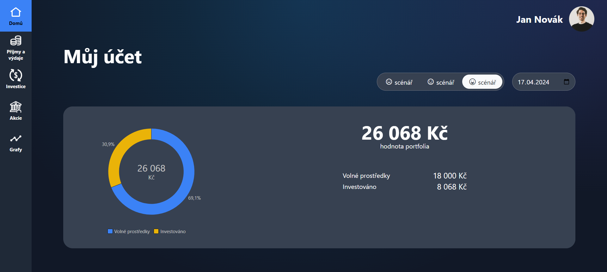
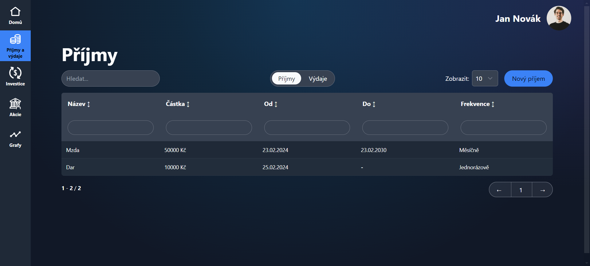
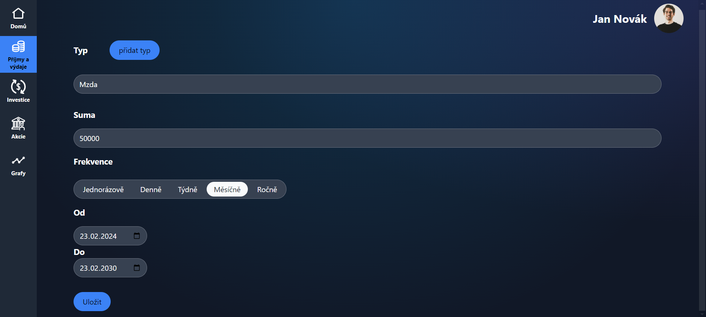
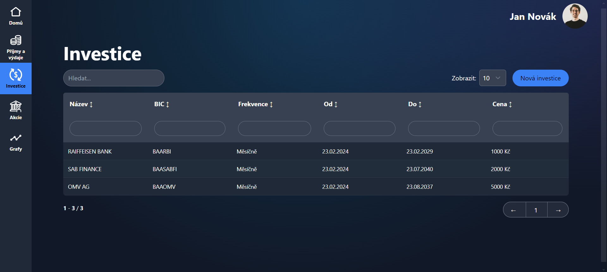
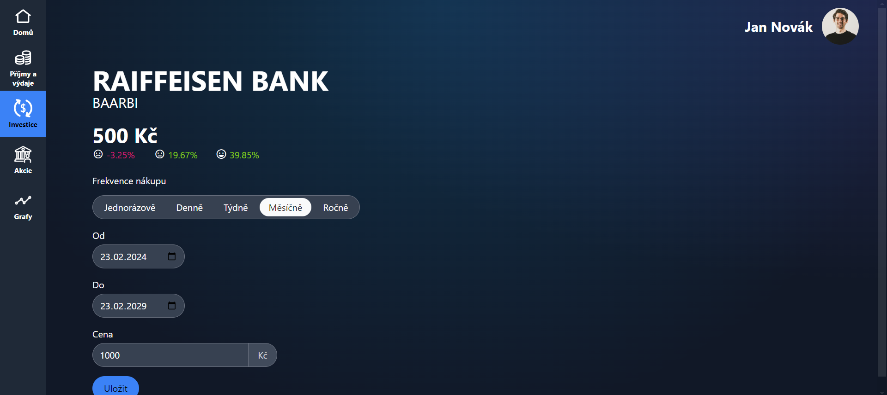
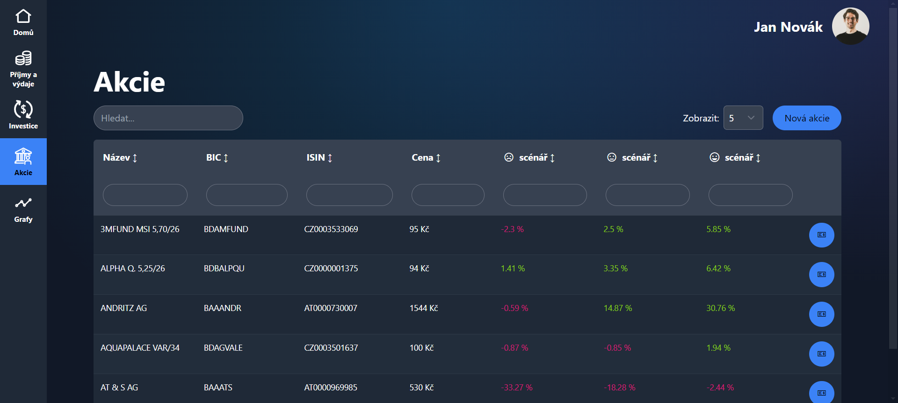
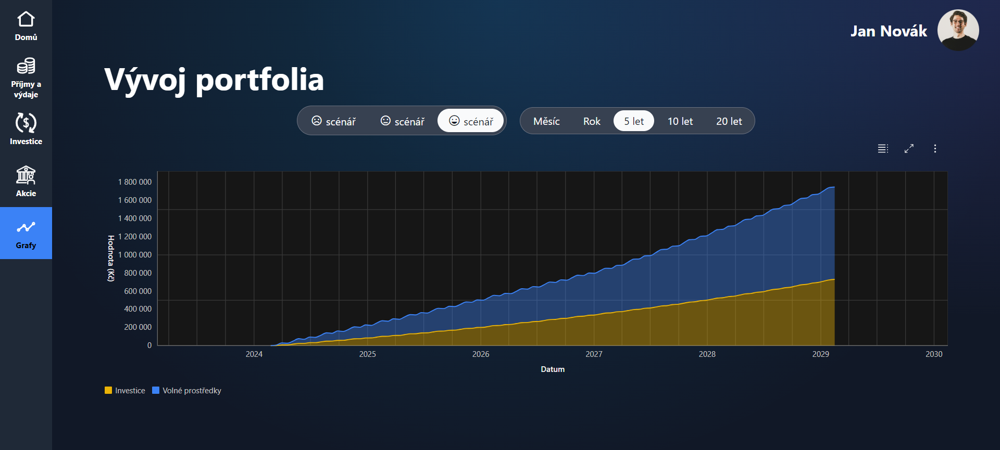

# 📈 BSEC 2024 - Modelace Investovaní

Projekt byl vytvořen v rámci hackathonu za asi 16 hodin čistého času (https://best-bsec.cz/)

S tímto řešením jsme se jako tým umístili na 🥇 místě. Celé zadání [zde](data/Modelace_investovani_v2.pdf)

## Prerekvizity

`node >= 18`

## Instalace a spuštění

```
npm i
npm run dev
```

## Screenshoty









## Použité technologie
- Typescript
- SvelteKit
- SkeletonUI
- TailwindCSS
- Line Awesome
- Carbon Charts
- PrismaORM
- SQLite
